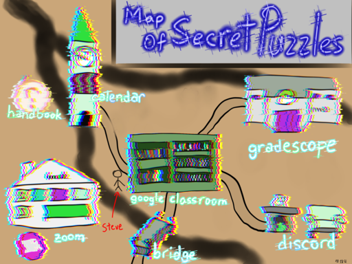

# mosp.evanchen.cc

To play, head to [mosp.evanchen.cc](https://mosp.evanchen.cc).

## Repository information

This repository contains the build files for the static version of `mosp.evanchen.cc`,
which hosted the MOP puzzle hunt that ran from 2021 to 2022.
The 2021 archive is complete; the 2022 archive is missing a lot of information.

Previously, we used a simple Django website
that was hosted at [vEnhance/mosp-web](https://github.com/vEnhance/mosp-web).

**Warning**: the repository contains spoilers (full solutions).
